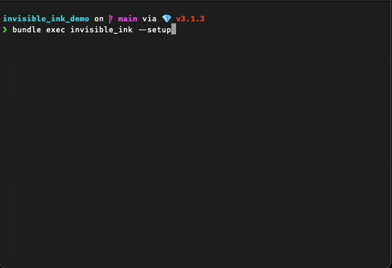

# 🔏 Invisible Ink

Encrypt text files in your open source projects so that they can be committed to
your repository without exposing sensitive information.

## 📸 Demo



## ✅ Installation

Install the gem and add to the application's Gemfile by executing:

    $ bundle add invisible_ink

If bundler is not being used to manage dependencies, install the gem by executing:

    $ gem install invisible_ink


## ℹ️  Usage

Once installed in your project's `Gemfile`, run `bundle exec invisible_ink
--setup` to create an encryption key saved to `invisible_ink.key`. This will
also update your `.gitignore` file to ensure the key is not saved to version
control.

Alternatively, you can set `ENV["INVISIBLE_INK_KEY"]` to the value of a 32
character hash.

### ⌨️ Commands

```text
Usage: invisible_ink COMMAND [options]
    -w, --write FILE                 Encrypt a file using an encryption key and open it in the specified $EDITOR
    -r, --read FILE                  Decrypt and display the content of an encrypted file
    -s, --setup                      Generate an encryption key, save it to a file, and add it to .gitignore
    -h, --help                       Display help message
    -v, --version                    Display Gem version
```

## 🔨 Development

After checking out the repo, run `bin/setup` to install dependencies. Then, run
`rake spec` to run the tests. You can also run `bin/console` for an interactive
prompt that will allow you to experiment.

To install this gem onto your local machine, run `bundle exec rake install`. To
release a new version, update the version number in `version.rb`, and then run
`bundle exec rake release`, which will create a git tag for the version, push
git commits and the created tag, and push the `.gem` file to
[rubygems.org](https://rubygems.org).

## 🙏 Contributing

Bug reports and pull requests are welcome on GitHub at
https://github.com/stevepolitodesign/invisible_ink. This project is intended to be a
safe, welcoming space for collaboration, and contributors are expected to adhere
to the [code of
conduct](https://github.com/stevepolitodesign/invisible_ink/blob/main/CODE_OF_CONDUCT.md).

## 📜 License

The gem is available as open source under the terms of the [MIT
License](https://opensource.org/licenses/MIT).

## ❤️ Code of Conduct

Everyone interacting in the InvisibleInk project's codebases, issue trackers,
chat rooms and mailing lists is expected to follow the [code of
conduct](https://github.com/stevepolitodesign/invisible_ink/blob/main/CODE_OF_CONDUCT.md).
